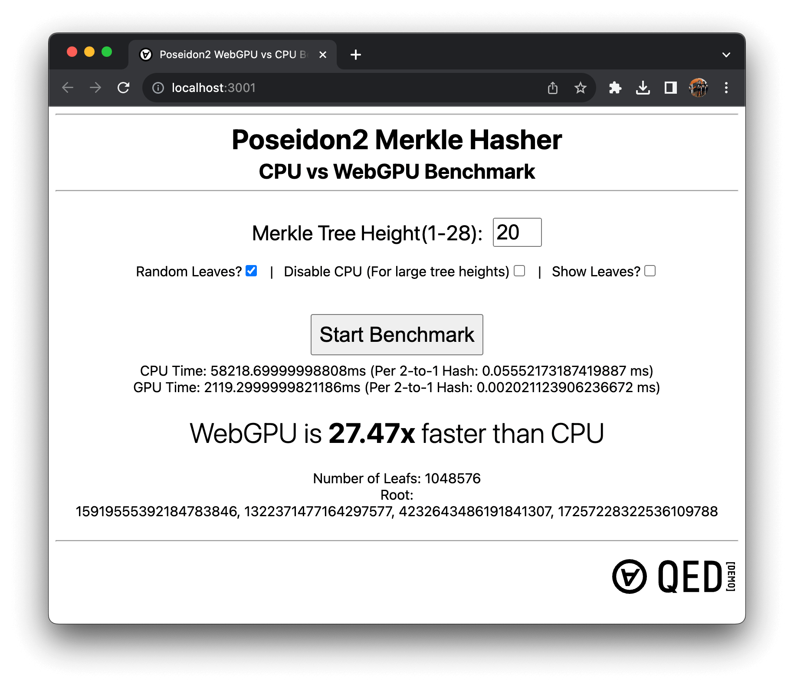

<p align="center">
  
  <h1>Poseidon2 WebGPU Demo</h1> 
  <p>

A browser benchmark which compares the performance of hashing a poseidon2-goldilocks merkle tree on CPU using the <a href="https://github.com/OpenAssetStandards/poseidon2">poseidon2 npm package</a> vs. our experimental WebGPU poseidon2 compute shader.</p>

</p>

### Demo Link - Note: Required latest version of Chrome/WebGPU supported browser
<p align="center">

<a href="https://webgpu-demo.qedprotocol.com">

</a>
<p align="center">
<a href="https://webgpu-demo.qedprotocol.com">
https://webgpu-demo.qedprotocol.com
</a>
</p>
</p>

## Setup
```
pnpm i
pnpm start
```

_(you can use your favorite node package manager if you do not have pnpm installed)_

### Note: This benchmark <u>only</u> works on [browsers which have support for WebGPU](https://caniuse.com/webgpu)

## Benchmark Results on Chrome / 2021 Apple M1 Max (MacBook Pro)

| Merkle Tree Height  | Total Time CPU (ms) | Total Time WebGPU (ms) | WebGPU Performace Gain |
| ------------------- | ------------------- | ---------------------- | ---------------------- |
| 8 (256 Leaves)      | 15.09 ms            | 32.07 ms               | 2.1x Slower than CPU   |
| 12 (4096 Leaves)    | 216.1 ms            | 40.8 ms                | 5.3x Faster than CPU   |
| 16 (65536 Leaves)   | 3606.4 ms           | 177.2 ms               | 20.35x Faster than CPU |
| 20 (1048676 Leaves) | 58219.7 ms          | 2119.3 ms              | 27.47x Faster than CPU |

### Info/Tips

- Our WebGPU compute shader can be found in [src/webgpu/poseidon2-goldilocks.wgsl](src/webgpu/poseidon2-goldilocks.wgsl).
- Right now there are limitations on how much memory can be allocated to WebGPU compute workgroups, so staying in the range of 1-22 height merkle trees is recommended (if you want larger, you can just create several job instances and then connect them with another small merkle tree on top)
- For tree heights greater than 20, CPU is so slow that the benchmark often freezes, but you can still benchmark WebGPU at these heights if you check the "Disable CPU" option

## Credits

Made with ❤️ by QED Team

Special thanks to [Recmo](https://github.com/recmo) for his uint128 implementation of [Goldilocks multiplication for WGSL](https://github.com/recmo/proto-goldilocks-webgpu/blob/cc6ce5d2df8a20ba89484a49f82b0037f8fd5676/shader/goldilocks.wgsl#L50)

## License

MIT License

Copyright (c) 2023 Zero Knowledge Labs Limited

Permission is hereby granted, free of charge, to any person obtaining a copy
of this software and associated documentation files (the "Software"), to deal
in the Software without restriction, including without limitation the rights
to use, copy, modify, merge, publish, distribute, sublicense, and/or sell
copies of the Software, and to permit persons to whom the Software is
furnished to do so, subject to the following conditions:

The above copyright notice and this permission notice shall be included in all
copies or substantial portions of the Software.

THE SOFTWARE IS PROVIDED "AS IS", WITHOUT WARRANTY OF ANY KIND, EXPRESS OR
IMPLIED, INCLUDING BUT NOT LIMITED TO THE WARRANTIES OF MERCHANTABILITY,
FITNESS FOR A PARTICULAR PURPOSE AND NONINFRINGEMENT. IN NO EVENT SHALL THE
AUTHORS OR COPYRIGHT HOLDERS BE LIABLE FOR ANY CLAIM, DAMAGES OR OTHER
LIABILITY, WHETHER IN AN ACTION OF CONTRACT, TORT OR OTHERWISE, ARISING FROM,
OUT OF OR IN CONNECTION WITH THE SOFTWARE OR THE USE OR OTHER DEALINGS IN THE
SOFTWARE.
